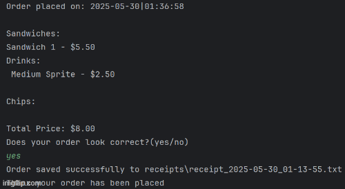

# DELI-cious Sandwich Ordering System

Welcome to the DELI-cious Sandwich Ordering System, a console based application that allows users to customize and place sandwich, drink, and chip orders. 

### Features

- Create and Customize sandwiches, drinks, and chips
- Object-oriented design using encapsulation and modular methods
- Great design and ready for future enhancements like sandwich combos, drink combos and order history

### Prerequisites

- IntelliJ IDEA: Ensure you have IntelliJ IDEA installed, which you can download from [here](https://www.jetbrains.com/idea/download/).
- Java SDK: Make sure Java SDK is installed and configured in IntelliJ.

### Running the Application in IntelliJ

Follow these steps to get your application running within IntelliJ IDEA:

1. Open IntelliJ IDEA.
2. Select "Open" and navigate to the directory where you cloned or downloaded the project.
3. After the project opens, wait for IntelliJ to index the files and set up the project.
4. Find the main class with the `public static void main(String[] args)` method.
5. Right-click on the file and select 'Run 'YourMainClassName.main()'' to start the application.

### Technologies Used

- Java Maven 17

### Demo

This gif shows the different menus and screens within the app.

## Thanks to
All my fellow Year Up teammates for their dedication, teamwork, continuous support, and guidance throughout this project.